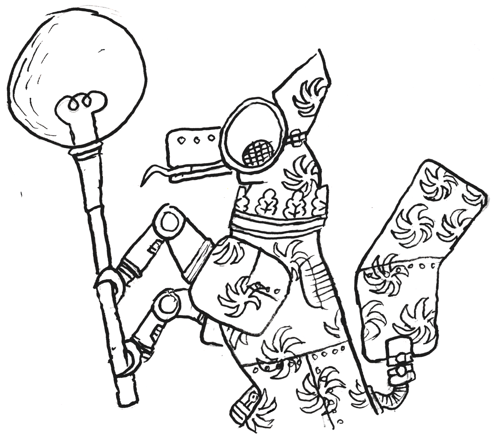

# Heraldtron

A heraldry-related bot, designed for the [Heraldry Community](https://twitter.com/arm_yourselves). Still very much a work in progress.

## Requirements

* Python 3.7+
* [discord.py](https://pypi.org/project/discord.py/)
* [python-dotenv](https://pypi.org/project/python-dotenv/)
* A bot account in the Discord Developer Portal ([see here for a basic how to](https://realpython.com/how-to-make-a-discord-bot-python/))
* For image search functionality, a [Google Cloud Platform](https://cloud.google.com) API key supporting Google Custom Search

## Usage

To connect to your bot account, initialise a `.env` file containing your `DISCORD_TOKEN` and `GCS_TOKEN` in the `ht` directory.

Then use the standard Python package initialisation method (of course, use `python3` if there is an overlapping python2 install): 

```
cd path/to/heraldtron
python -m ht
```
